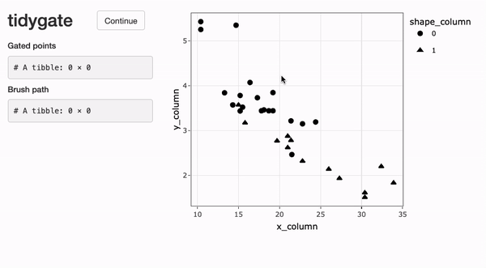
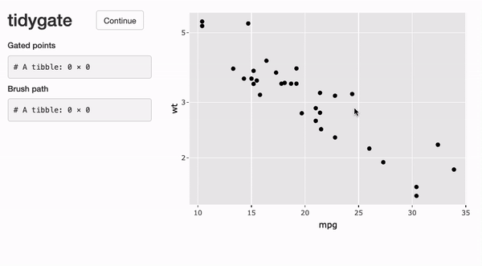

<!---
[](https://travis-ci.org/stemangiola/tidygate) [](https://coveralls.io/github/stemangiola/tidygate?branch=master)
-->
<!-- badges: start -->
  [](https://lifecycle.r-lib.org/articles/stages.html)
<!-- badges: end -->

Please have a look also to

- [nanny](https://github.com/stemangiola/nanny) for tidy high-level data analysis and manipulation

- [tidyHeatmap](https://github.com/stemangiola/tidyHeatmap) for producing heatmaps following tidy principles

- [tidybulk](https://github.com/stemangiola/tidybulk) for tidy and modular transcriptomics analyses

```{r, echo=FALSE, include=FALSE, }
library(knitr)
knitr::opts_chunk$set(cache = TRUE, warning = FALSE,
                      message = FALSE, cache.lazy = FALSE)

library(dplyr)
library(tidygate)
```

## Introdiction 

tidygate allows you to interactively gate data by user-defined X and Y coordinates with a single 
line of code. If greater flexibility is needed, [ggplot2](https://ggplot2.tidyverse.org/) 
can be leveraged to enable near endless plot customisation. 

Interactively drawn gates are recorded and can be applied programmatically to reproduce results exactly. Programmatic gating is based on the package [gatepoints](https://github.com/wjawaid/gatepoints) by Wajid Jawaid. 

## Installation

```{r, eval=FALSE}
# From Github
devtools::install_github("stemangiola/tidygate")

# From CRAN
install.package("tidygate")
```

## Example usage 

tidygate provides three user-facing functions, `gate_simple`, `gate_custom` and `gate_programmatic`.
The following examples will make use of these functions, along with dplyr, ggplot2 and the inbuilt
`mtcars` dataset. 

```{r}
library(tidygate)
library(dplyr)
library(ggplot2)

mtcars
```

`gate_simple` can be used to quickly interactively gate points based on their X and Y coordinates. 
Additional parameters can be provided to modify point colour, shape, size and alpha. 

```{r eval=FALSE}
mtcars |>
  mutate(gate = gate_simple(x_column = mpg, y_column = wt, shape_column = factor(am), size = 2))
```



`gate_custom` allows the user to define their own plot using ggplot2, and then 
interactively gate points. For example, this enables the application of a log scale or custom theme.

```{r eval=FALSE}
scaled_plot <- 
  mtcars |>
  mutate(.key = row_number()) |>
  ggplot(aes(x = mpg, y = wt, key = .key)) +
  scale_y_log10() +
  geom_point() +
  theme_grey()

mtcars_gated <-
  mtcars |>
  mutate(gate = gate_custom(plot = scaled_plot))

mtcars_gated
```




```{r, echo=FALSE}
# tidygate_env$select_data |> write.csv("data/custom_gating_demo_select_data.csv")
# tidygate_env$brush_data |> write.csv("data/custom_gating_demo_brush_data.csv")

# Load pre-recorded brush path from data for example
tidygate_env <<- rlang::env()
tidygate_env$select_data <- read.csv("data/custom_gating_demo_select_data.csv")
tidygate_env$brush_data <- read.csv("data/custom_gating_demo_brush_data.csv")

mtcars_gated <- 
  mtcars |>
  mutate(gate = gate_programmatic(
    x_column = mpg, y_column = wt, tidygate_env$brush_data
  ))
```

To select points which appear within any gates, the `lengths()` function can be used. To select points which appear within a specific gate, `map_lgl()` can be used with `any()` to check each value in the gate results column for each cell. 

```{r}
# Select cells within any gate
mtcars_gated |> 
  filter(lengths(gate) > 0)

# Select cells within gate 2
mtcars_gated |>
  filter(purrr::map_lgl(gate, ~ any(2 %in% .x)))
```

Details of the gated points and lasso brush selection are stored within the `tidygate_env` 
environment. These variables are overwritten each time interactive gating is run, so save them
right away if you would like to access them later.  

```{r eval=FALSE}
tidygate_env$select_data
tidygate_env$brush_data
```

`gate_programmatic` gates points programmatically by their X and Y coordinates, and a predefined lasso brush path. This function can be used to make interactive gates reproducible. Here `gate_programmatic` reproduces the previous defined interactive gates exactly. 

```{r eval=FALSE}
mtcars_gated |>
  mutate(gate_programatic = gate_programmatic(
    x_column = mpg, y_column = wt, tidygate_env$brush_data
  )) 
```
