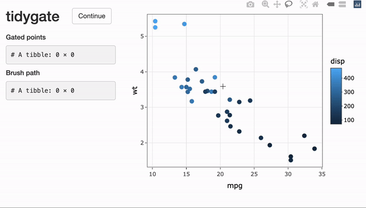

<!---
[](https://travis-ci.org/stemangiola/tidygate) [](https://coveralls.io/github/stemangiola/tidygate?branch=master)
-->

<!-- badges: start -->
  [](https://lifecycle.r-lib.org/articles/stages.html)
<!-- badges: end -->

```{r, echo=FALSE, include=FALSE, }
library(knitr)
knitr::opts_chunk$set(cache = TRUE, warning = FALSE,
                      message = FALSE, cache.lazy = FALSE)

library(dplyr)
library(tidygate)
```

## Introduction 

tidygate allows you to interactively gate points on a scatter plot. Interactively drawn gates are recorded and can be applied programmatically to reproduce results exactly. Programmatic gating is based on the package [gatepoints](https://github.com/wjawaid/gatepoints) by Wajid Jawaid. 

For more tidy data analysis:

- [tidyomics](https://github.com/tidyomics) - A software ecosystem for tidy analysis of omic data.
- [tidyHeatmap](https://github.com/stemangiola/tidyHeatmap) - Produce heatmaps with tidy principles.

## Installation

```{r, eval=FALSE}
# From Github
devtools::install_github("stemangiola/tidygate")

# From CRAN
install.package("tidygate")
```

## Example usage 

tidygate provides two user-facing functions: `gate_interactive` and `gate_programmatic`.
The following examples will make use of these functions, dplyr's `mutate` and the inbuilt `mtcars` dataset. 

```{r}
library(tidygate)
library(dplyr)
library(ggplot2)

mtcars
```

`gate_interactive` creates an interactive scatter plot based on user-defined X and Y coordinates. Colour, shape, size and alpha can be defined as constant values, or can be controlled by values in a specified column. 

Once the plot has been created, multiple lasso selection gates can be drawn with the mouse. When you have finished your selection, `gate_interactive` will return a vector of lists, recording the gates each X and Y coordinate pair is within.

```{r eval=FALSE}
mtcars_gated <- 
  mtcars |>
  mutate(gated_interactively = gate_interactive(x = mpg, y = wt, colour = disp))
```



```{r, echo=FALSE}
load("data/demo_brush_data.rda")
load("data/demo_select_data.rda")

# Load pre-recorded brush path from data for example
tidygate_env <<- rlang::env()
tidygate_env$select_data <- demo_select_data
tidygate_env$brush_data <- demo_brush_data

mtcars_gated <- 
  mtcars |>
  mutate(gated_interactively = gate_programmatic(
    x = mpg, y = wt, brush_data = tidygate_env$brush_data
  ))
```

To select points which appear within any gates, the `lengths()` function can be used. To select points which appear within a specific gate, `map_lgl()` can be used with `any()` to check each value in the gate results column for each point. 

```{r}
# Select points within any gate
mtcars_gated |> 
  filter(lengths(gated_interactively) > 0)

# Select cells within gate 2
mtcars_gated |>
  filter(purrr::map_lgl(gated_interactively, ~ any(2 %in% .x)))
```

Details of the gated points and lasso brush path are stored within the `tidygate_env` environment. These variables are overwritten each time interactive gating is run, so save them right away if you would like to access them later.  

```{r}
# Gated points
tidygate_env$select_data |>
  head()

# Brush path
tidygate_env$brush_data |>
  head()
```

`gate_programmatic` gates points programmatically by their X and Y coordinates, and a predefined lasso brush path. This function can be used to make interactive gates reproducible. Here `gate_programmatic` reproduces the previous defined interactive gates exactly. 

```{r}
mtcars_gated <-
  mtcars_gated |>
  mutate(gated_programmatically = gate_programmatic(
    x = mpg, y = wt, brush_data = tidygate_env$brush_data
  ))

mtcars_gated |> 
  filter(lengths(gated_programmatically) > 0)
```
